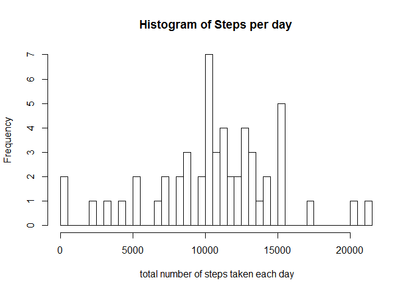
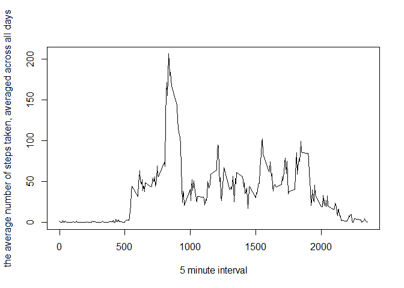
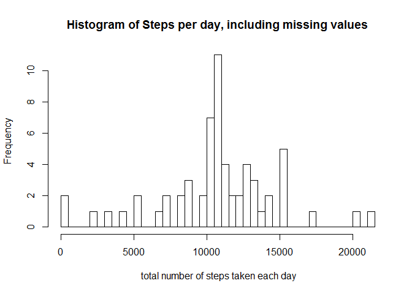
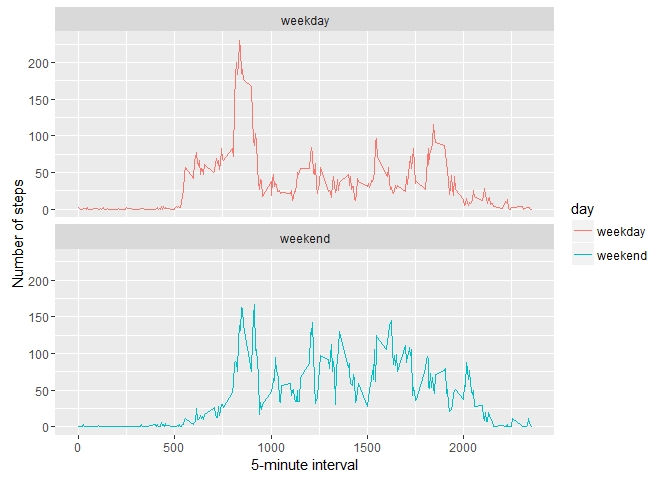

# Reproducible Research: Peer Assessment 1

```r
library(dplyr)
```

```
## 
## Attaching package: 'dplyr'
```

```
## The following objects are masked from 'package:stats':
## 
##     filter, lag
```

```
## The following objects are masked from 'package:base':
## 
##     intersect, setdiff, setequal, union
```

```r
library(ggplot2)
library(lubridate)
```

## Loading and preprocessing the data


```r
ActivityDataSet <- read.csv("./repdata-data-activity/activity.csv");
ActivitySet <- group_by(ActivityDataSet, date) %>% summarise(sum(steps));
```


## What is mean total number of steps taken per day?


```r
### Generating the Historgram of total stps per day
hist(ActivitySet$`sum(steps)`, breaks = 61, xlab = " total number of steps taken each day", 
        main = "Histogram of Steps per day");
```




### Mean and Median of Total Steps

```r
meanOfTotalStep <- mean(ActivitySet$`sum(steps)`, na.rm = T);
medianOfTotalStep <- median(ActivitySet$`sum(steps)`, na.rm = T);
```

## What is the average daily activity pattern?


```r
### Make Time series plot
ActivitySet <- select(ActivityDataSet, date, interval, steps) %>%
                 group_by(interval) %>%
                 summarise(average = mean(steps, na.rm = T));
plot(ActivitySet$interval, ActivitySet$average, type = "l", 
     xlab = "5 minute interval", ylab = "the average number of steps taken, averaged across all days");
```



```r
### Max average step in the interval of 4 minutes
MaxSteps <- select(ActivitySet, interval, average) %>% filter(average == max(average, na.rm = T))
```

## Imputing missing values

```r
###Calculate the missing Value
MissingValue <- is.na(ActivityDataSet$steps)
table(MissingValue)
```

```
## MissingValue
## FALSE  TRUE 
## 15264  2304
```

```r
### Fill the missing values
fillFunction <- function(steps, intervals){
        fill <- NA;
        if (is.na(steps)) {
             fill <- (ActivitySet[ActivitySet$interval == intervals, "average"])
        }
        else (
                fill <- c(steps)
        )
        
        return (fill)
}

CompleteData <- ActivityDataSet
CompleteData$steps <- mapply(fillFunction, CompleteData$steps, CompleteData$interval)

### Generate Histogram of Complete Data set
CompleteData$steps <- as.numeric(CompleteData$steps)
CompleteActivitySet <- group_by(CompleteData, date) %>% summarise(sum(steps));
hist(CompleteActivitySet$`sum(steps)`, breaks =  61, 
     xlab = " total number of steps taken each day", main = "Histogram of Steps per day, including missing values");
```



```r
meanOfTotalStepCom <- mean(CompleteActivitySet$`sum(steps)`, na.rm = T);
medianOfTotalStepCOm <- median(CompleteActivitySet$`sum(steps)`, na.rm = T);
```

## Are there differences in activity patterns between weekdays and weekends?

```r
weekday.or.weekend <- function(date) {
        day <- weekdays(date)
        if (day %in% c("Monday", "Tuesday", "Wednesday", "Thursday", "Friday"))
                return("weekday")
        else if (day %in% c("Saturday", "Sunday"))
                return("weekend")
        else
                stop("invalid date")
}
CompleteData$date <- as.Date(CompleteData$date)
CompleteData$day <- sapply(CompleteData$date, FUN=weekday.or.weekend)

averages <- aggregate(steps ~ interval + day, data=CompleteData, mean)
ggplot(averages, aes(interval, steps, color = day)) + geom_line() + facet_wrap(~day, ncol = 1, nrow = 2) +
        xlab("5-minute interval") + ylab("Number of steps")
```


